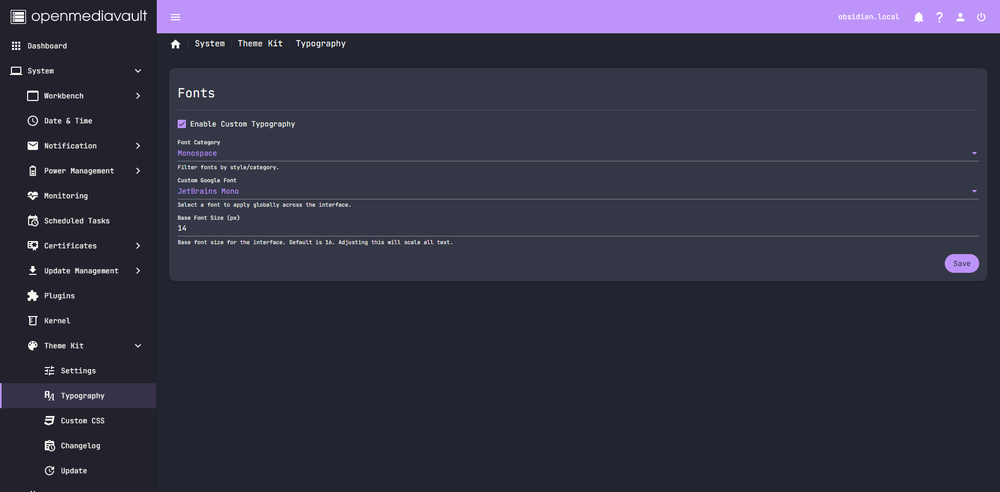
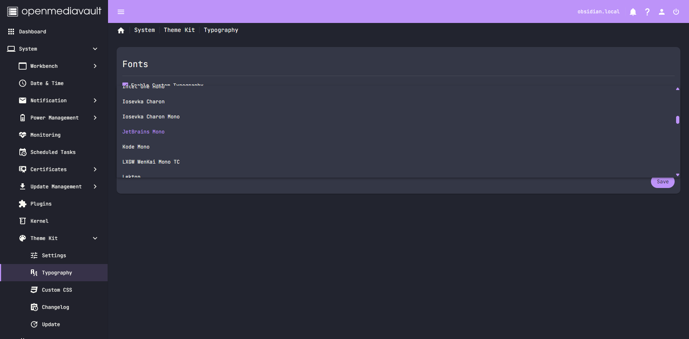
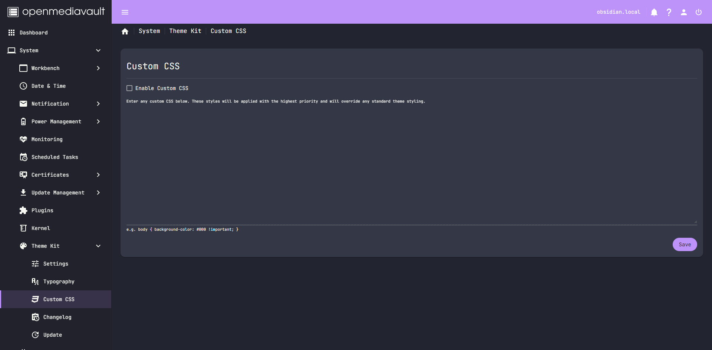
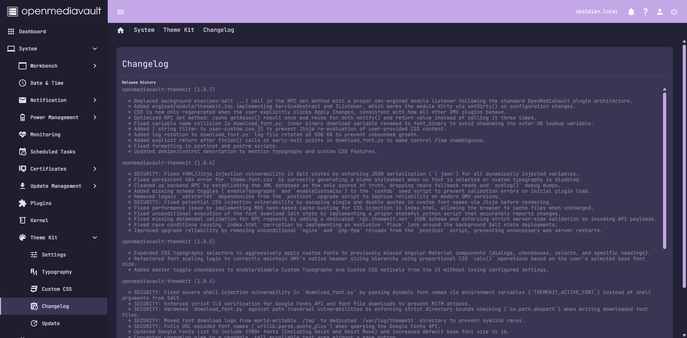
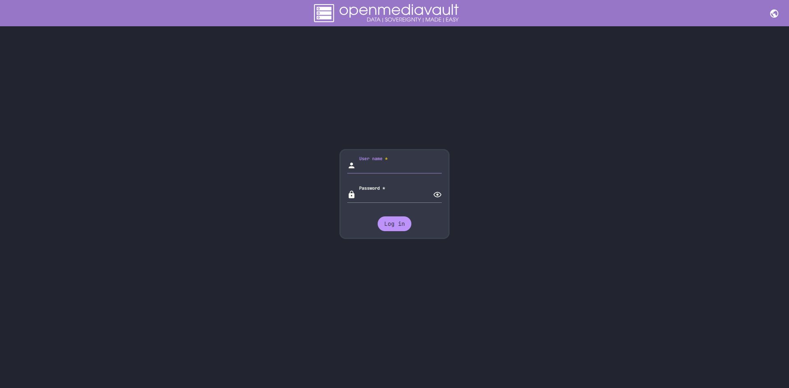
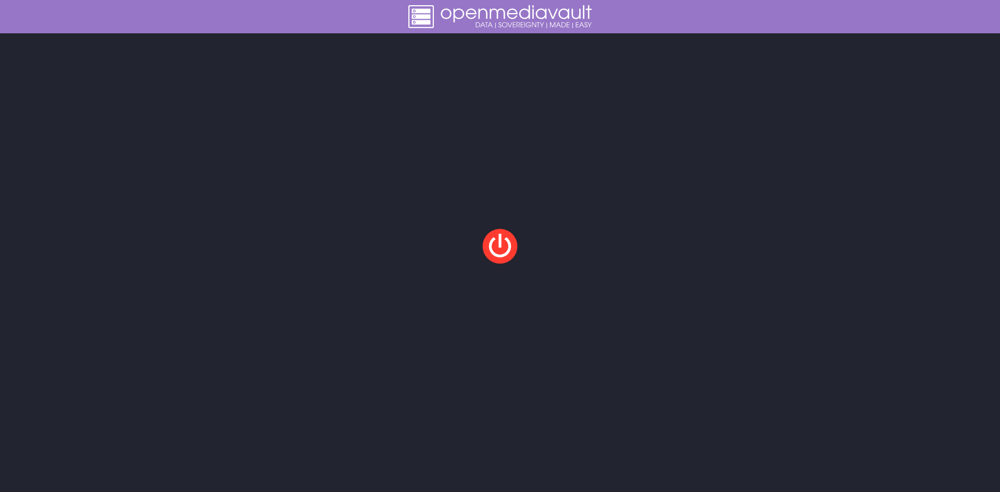

# openmediavault-themekit

An OMV 8 plugin: a "Theme Kit" page under System that allows you to deeply customize the OpenMediaVault UI.
Features include customizing the accent color using a massive Tailwind color palette, applying a variety of gorgeous community themes, injecting Google Fonts for custom typography, and writing your own custom CSS.

Settings are stored in OMV's config database, and a Salt state renders them into actual CSS files. A `dpkg` trigger re-runs that Salt state whenever `openmediavault-webgui` updates `index.html`, so your theme and fonts survive OMV updates. Configuration changes are handled cleanly through OMV's native `omv-engined` module listeners.

## Screenshots

|                                                                                                                                                                                                                                                                                                                                                                                                                                                                                                                                                                                                                                                                                                                                                                                                                                                                                                                                                                                                                                                                                                                                                                                                                                                                          |                                                                                                                                                              |
| :----------------------------------------------------------------------------------------------------------------------------------------------------------------------------------------------------------------------------------------------------------------------------------------------------------------------------------------------------------------------------------------------------------------------------------------------------------------------------------------------------------------------------------------------------------------------------------------------------------------------------------------------------------------------------------------------------------------------------------------------------------------------------------------------------------------------------------------------------------------------------------------------------------------------------------------------------------------------------------------------------------------------------------------------------------------------------------------------------------------------------------------------------------------------------------------------------------------------------------------------------------------------: | :----------------------------------------------------------------------------------------------------------------------------------------------------------: |
| <br><sub>default</sub><br>                      |                     <br><sub>[alucard-actual](https://github.com/lelemm/alucard-actual)</sub>                      |
|                                                                                                                                                                                                                                                                                                                                                                                                                                                                                                                                                          <br><sub>[actual-black-gold-theme](https://github.com/MikesGlitch/actual-black-gold-theme)</sub>                                                                                                                                                                                                                                                                                                                                                                                                                                                                                                                                                           |       <br><sub>[actual-butterfly-theme](https://github.com/samekh248/actual-butterfly-theme)</sub>       |
|                                                                                                                                                                                                                                                                                                                                                                                                                                                                                                                                                      <br><sub>[catppuccin-frappe-actual](https://github.com/noahjalex/catppuccin-frappe-actual)</sub>                                                                                                                                                                                                                                                                                                                                                                                                                                                                                                                                                       |  <br><sub>[catppuccin-latte-actual](https://github.com/noahjalex/catppuccin-latte-actual)</sub>   |
|                                                                                                                                                                                                                                                                                                                                                                                                                                                                                                                                                <br><sub>[catppuccin-macchiato-actual](https://github.com/noahjalex/catppuccin-macchiato-actual)</sub>                                                                                                                                                                                                                                                                                                                                                                                                                                                                                                                                                 |  <br><sub>[catppuccin-mocha-actual](https://github.com/noahjalex/catppuccin-mocha-actual)</sub>   |
|                                                                                                                                                                                                                                                                                                                                                                                                                                                                                                                                                                                   <br><sub>[okabe-ito](https://github.com/Juulz/okabe-ito)</sub>                                                                                                                                                                                                                                                                                                                                                                                                                                                                                                                                                                                   |                     <br><sub>[dracula-actual](https://github.com/lelemm/dracula-actual)</sub>                      |
|                                                                                                                                                                                                                                                                                                                                                                                                                                                                                                                                                         <br><sub>[gruvbox-dark-actualbudget](https://github.com/Dakyne/gruvbox-dark-actualbudget)</sub>                                                                                                                                                                                                                                                                                                                                                                                                                                                                                                                                                         | <br><sub>[gruvbox-light-actualbudget](https://github.com/Dakyne/gruvbox-light-actualbudget)</sub> |
|                                                                                                                                                                                                                                                                                                                                                                                                                                                                                                                                                               <br><sub>[high-contrast-light](https://github.com/Juulz/high-contrast-light)</sub>                                                                                                                                                                                                                                                                                                                                                                                                                                                                                                                                                                |                           <br><sub>[Ilavenil](https://github.com/aadhithbala/Ilavenil)</sub>                            |
|                                                                                                                                                                                                                                                                                                                                                                                                                                                                                                                                                         <br><sub>[actualbudget-matrix-theme](https://github.com/MatissJanis/actualbudget-matrix-theme)</sub>                                                                                                                                                                                                                                                                                                                                                                                                                                                                                                                                                         |                         <br><sub>[miami-beach](https://github.com/Juulz/miami-beach)</sub>                         |
|                                                                                                                                                                                                                                                                                                                                                                                                                                                                                                                                                                      <br><sub>[actual-nord-theme](https://github.com/aadhithbala/actual-nord-theme)</sub>                                                                                                                                                                                                                                                                                                                                                                                                                                                                                                                                                                      |            <br><sub>[Notion-Dark-Mode](https://github.com/vcruzdesigns/Notion-Dark-Mode)</sub>            |
|                                                                                                                                                                                                                                                                                                                                                                                                                                                                                                                                                                      <br><sub>[rose-pine-actual](https://github.com/PencilKnot/rose-pine-actual)</sub>                                                                                                                                                                                                                                                                                                                                                                                                                                                                                                                                                                      |      <br><sub>[rose-pine-dawn-actual](https://github.com/PencilKnot/rose-pine-dawn-actual)</sub>       |
|                                                                                                                                                                                                                                                                                                                                                                                                                                                                                                                                                            <br><sub>[rose-pine-moon-actual](https://github.com/PencilKnot/rose-pine-moon-actual)</sub>                                                                                                                                                                                                                                                                                                                                                                                                                                                                                                                                                             |               <br><sub>[shades-of-coffee](https://github.com/Juulz/shades-of-coffee)</sub>                |
|                                                                                                                                                                                                                                                                                                                                                                                                                                                                                                                                                                         <br><sub>[shades-of-gray](https://github.com/Juulz/shades-of-gray)</sub>                                                                                                                                                                                                                                                                                                                                                                                                                                                                                                                                                                          |                         <br><sub>[simple-dark](https://github.com/Juulz/simple-dark)</sub>                         |
|                                                                                                                                                                                                                                                                                                                                                                                                                                                                                                                                                                                   <br><sub>[1970-theme](https://github.com/Juulz/1970-theme)</sub>                                                                                                                                                                                                                                                                                                                                                                                                                                                                                                                                                                                    |                   <br><sub>[thyrium-actual](https://github.com/carlisle96/thyrium-actual)</sub>                    |
|                                                                                                                                                                                                                                                                                                                                                                                                                                                                                                                                                                            <br><sub>[YNA-Theme-Dark](https://github.com/Juulz/YNA-Theme-Dark)</sub>                                                                                                                                                                                                                                                                                                                                                                                                                                                                                                                                                                            |                    <br><sub>[YNA-Theme-Light](https://github.com/Juulz/YNA-Theme-Light)</sub>                    |
|                                                                                                                                                                                                                                                                                                                                                                                                                                                                                                                                                           <br><sub>[you-need-a-dark-mode](https://github.com/distantvapor/you-need-a-dark-mode)</sub>                                                                                                                                                                                                                                                                                                                                                                                                                                                                                                                                                           |     <br><sub>[actual-theme-zero-dark](https://github.com/deathblade666/actual-theme-zero-dark)</sub>      |

### Features & UI

|                                                                                                  |                                                                                                              |
| :----------------------------------------------------------------------------------------------: | :----------------------------------------------------------------------------------------------------------: |
|         <br><sub>Typography Settings</sub>         |       <br><sub>Google Fonts Integration</sub>       |
| <br><sub>Font Categories</sub> |               <br><sub>Custom CSS Editor</sub>               |
|            <br><sub>In-App Changelog</sub>            | <br><sub>Login Screen (Accent Background & Topbar Tint)</sub> |
|             <br><sub>Shutdown Screen</sub>             |                 <br><sub>Standby Screen</sub>                 |

## Features

- **Themes:** Over 20 built-in themes (Catppuccin, Dracula, Nord, Rose Pine, Gruvbox, etc.) ported for OMV.
- **Accent Colors:** Pick from the full TailwindCSS color palette to customize buttons, active tabs, and highlights.
- **Typography:** Dynamically downloads and applies Google Fonts to the UI. Choose separate fonts for sans-serif, serif, display, handwriting, and monospace text.
- **Custom CSS:** Directly inject your own CSS to tweak any part of the UI.
- **Special Pages Accent:** Optionally replace the login/shutdown wallpaper with a solid accent color.
- **Native OMV Integration:** Fully utilizes OMV's `confdb`, `omv-engined`, and `salt` architecture. Uses OMV's built-in module listener pattern, showing the standard yellow "Apply Changes" banner when you save.

## Installation

You can install the plugin either via the APT repository (recommended for automatic updates) or by manually downloading the `.deb` file.

### Method 1: APT Repository (Recommended)

First, add the repository and then install via `apt`:

```bash
# Add the GPG key
sudo curl -fsSL https://snakkarike.github.io/openmediavault-themekit/themekit-archive-keyring.gpg \
  -o /usr/share/keyrings/themekit-archive-keyring.gpg

# Add the repository
echo "deb [signed-by=/usr/share/keyrings/themekit-archive-keyring.gpg] \
https://snakkarike.github.io/openmediavault-themekit stable main" | \
  sudo tee /etc/apt/sources.list.d/themekit.list

# Update and install
sudo apt update
sudo apt install openmediavault-themekit
```

### Method 2: Manual Download (.deb)

Download the latest release and install it via `dpkg`:

```bash
# Always grabs the newest release, no version number to remember or update
wget https://github.com/snakkarike/openmediavault-themekit/releases/latest/download/openmediavault-themekit_all.deb

# Install the package
sudo dpkg -i openmediavault-themekit_all.deb
sudo apt-get install -f -y
```

Once installed using either method, refresh your browser (`Ctrl+Shift+R`) and look for "Theme Kit" under System in the OMV sidebar.

## Layout

- `debian/` - standard Debian packaging (control, rules, postinst, postrm, triggers)
- `usr/share/openmediavault/datamodels/` - config schema and RPC data models
- `usr/share/openmediavault/engined/rpc/themekit.inc` - get/set RPC backend
- `usr/share/openmediavault/engined/module/themekit.inc` - native engine module listener
- `usr/share/openmediavault/workbench/` - YAML manifests for the navigation entry, route, settings, typography, and changelog pages
- `srv/salt/omv/deploy/themekit/` - the Salt state + Jinja templates that actually apply the theme, fonts, and custom CSS to disk
- `debian/openmediavault-themekit.triggers` - dpkg trigger that re-applies the theme whenever `openmediavault-webgui` updates `index.html`

## Architecture Details

- No `css/` or `images/` directories exist in the webroot, only `assets/`. There is no pre-wired `theme-custom.css` hook anywhere.
- `index.html` loads a single hash-named bundle, `styles.<hash>.css`, that hash changes on every OMV rebuild, so nothing can reference it by name. The only stable injection point is patching `index.html` itself to add `<link>` tags right before `</head>`, after the hash-named stylesheet so ours wins the cascade.
- `index.html` is a package-tracked file and gets replaced wholesale on every `openmediavault-webgui` update, so the patch has to be idempotent and re-run on every deploy (handled in `init.sls` via `patch_index_html`), not just once at install.
- The CSS template violently overrides specific hardcoded elements in OMV 8 (like the `#5dacdf` blue used on the top toolbar and active tabs) to ensure your selected accent color applies everywhere, while leaving the default OMV dark/light mode system entirely intact.
- A Python script (`download_font.py`) invoked during Salt deployment intelligently downloads Google Fonts as WOFF2 binaries and embeds them locally into `/assets/fonts/`, bypassing the need for client-side API requests.

## Build from Source (For Developers)

**1. Clone it and install build dependencies**

```bash
sudo apt install -y git devscripts debhelper build-essential
cd ~
git clone https://github.com/snakkarike/openmediavault-themekit.git openmediavault-themekit
```

**2. Build the .deb**

```bash
cd ~/openmediavault-themekit
dpkg-buildpackage -us -uc -b
```

This drops the `.deb` file in `~` (one directory up from the source tree).

**3. Install it**

```bash
cd ~
sudo dpkg -i openmediavault-themekit_*_all.deb
sudo apt -f install
```

`postinst` runs automatically here: it registers the config schema, then calls `omv-salt deploy run themekit`, which is the step that actually writes `assets/theme-custom.css`, `assets/theme-font.css`, and patches `index.html`.

**4. Verify the backend before touching the UI**

```bash
omv-confdbadm read conf.service.themekit
omv-rpc "ThemeKit" "get"
```

Both should return JSON with the default schema.

**5. Load the UI**

Hard refresh (Ctrl+Shift+R, since `index.html` itself changed) and look for "Theme Kit" under System in the sidebar.

## Development & Upgrading

If you are modifying the code (e.g. editing `theme-custom.css.j2` or `init.sls`) and pushing to GitHub, you **must clear Salt's file cache** on the OMV server before applying the state, or Salt will aggressively serve the old template files.

Run this exact sequence to pull changes and force-apply them:

```bash
cd ~/openmediavault-themekit

# 1. Force sync the code from GitHub to ensure we get the latest commit
git fetch origin
git reset --hard origin/main

# 2. Rebuild the package
dpkg-buildpackage -us -uc -b
cd ..

# 3. Purge the old installation and do a clean install
sudo apt-get purge openmediavault-themekit -y
sudo dpkg -i openmediavault-themekit_*_all.deb
sudo apt-get install -f -y

# 4. NUKE Salt's file cache so it doesn't serve the old template
sudo rm -rf /var/cache/salt/minion/files

# 5. Apply the state manually to see immediate output
sudo salt-call --local state.apply omv.deploy.themekit
```

Once that completes successfully, do a hard refresh (`Ctrl+Shift+R`) in the OMV web interface.

## Uninstall

```bash
sudo apt purge openmediavault-themekit
```
